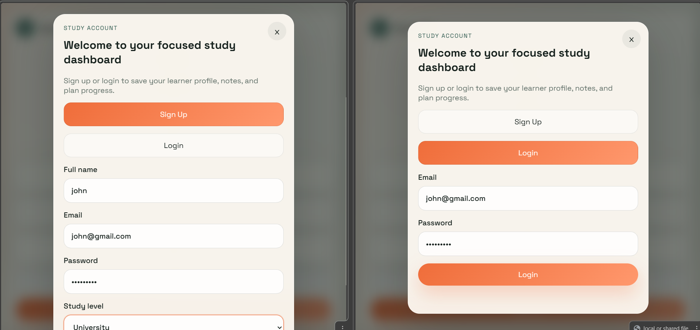
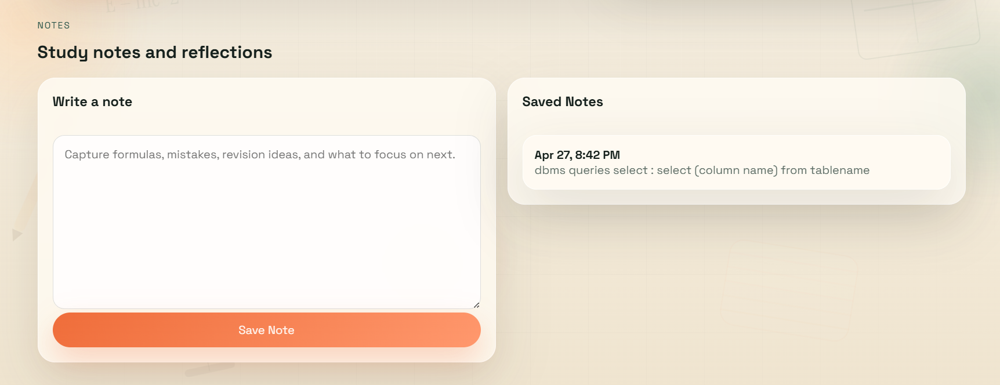
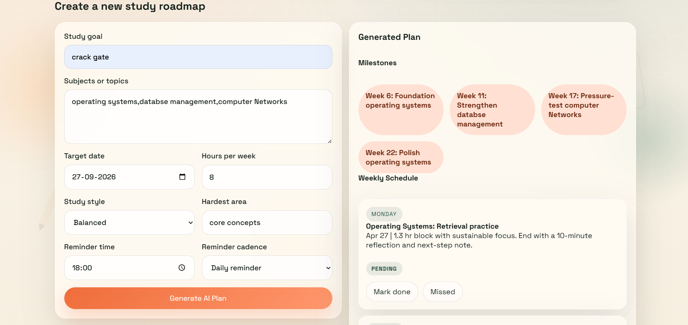

# 📄 AI Study Planner (DTI Lab Project Documentation)

🌐 **Live Demo:** [https://naga-lakshmi10.github.io/ai-study-planner-DTI/](https://naga-lakshmi10.github.io/ai-study-planner-DTI/)
🔗 Click the link above to explore the live application.


---

## 📌 1. Project Title

**AI Study Planner**

---

## 📌 2. Objective

The objective of this project is to design and develop a **responsive AI Study Planner web application interface** that helps students efficiently organize their study schedules, manage notes, track progress, and improve productivity using frontend technologies.

---

## 📌 3. Project Description

The **AI Study Planner** is a frontend-based web application that simulates a smart study management system. It provides an interactive user interface where students can:

- Create and manage study plans  
- Add and organize notes  
- Track study progress  
- View an overall study dashboard  

The application is developed using **HTML, CSS, and JavaScript** and runs completely in the browser without any backend support.

---

## 📌 4. Technologies Used

- HTML5 – Structure of the application  
- CSS3 – Styling and responsive design  
- JavaScript (Vanilla JS) – Logic and interactivity  
- LocalStorage (optional) – Client-side data storage  

---

## 📌 5. System Requirements

### 🔹 Hardware Requirements
- Laptop / Desktop Computer  
- Minimum 4GB RAM  

### 🔹 Software Requirements
- Web Browser (Chrome / Edge / Firefox)  
- VS Code or any text editor  

---

## 📌 6. Modules / Features

### 🏠 Home Dashboard
- Entry point of the application  
- Navigation to all modules  

### 📅 Study Planner Module
- Create daily and weekly study schedules  
- Organize subjects and tasks  

### 📝 Notes Module
- Add, view, and manage study notes  
- Easy editing and storage  

### 📊 Progress Tracking Module
- Track completed tasks  
- Visual progress representation  

### 🔐 Login Interface (UI)
- Simple login/signup UI  
- Basic authentication design  

### 🎯 Study Overview Dashboard
- Displays overall study summary  
- Centralized performance view  

---

## 📌 7. Working Methodology

1. User opens the application in a browser  
2. Home dashboard loads first  
3. User navigates through different modules  
4. Study plans and notes are created  
5. Progress is updated dynamically  
6. Study overview displays summary  

---

## 📌 8. Screenshots

### 🏠 Home Page


### 📊 Dashboard


### 🔐 Login Page


### 📝 Notes Section


### 📅 Study Plan Generator


### 📈 Progress Tracking


### 🎯 Study Overview


---

## 📌 9. Project Structure

```plaintext
ai-study-planner-DTI/
│
├── index.html
├── styles.css
├── script.js
├── README.md
├── DOCUMENTATION.md
├── AI_Study_Planner_Documentation.pdf
├── screenshots/
│   ├── dashboard.png
│   ├── generate_plan.png
│   ├── home_page.png
│   ├── login.png
│   ├── notes.png
│   ├── progress.png
│   └── study_overview.png
```


---

## 📌 10. Advantages

- Simple and user-friendly interface  
- Lightweight and fast application  
- No backend required  
- Helps students organize studies efficiently  
- Easy to use and understand  

---

## 📌 11. Limitations

- No database integration  
- Data may be lost on refresh (if not stored)  
- No AI-based backend logic  
- Limited scalability for large systems  

---

## 📌 12. Future Enhancements

- AI-based study recommendations  
- Backend integration using Firebase / Node.js  
- Cloud storage for notes and plans  
- User authentication system  
- Mobile application development  

---

## 📌 13. Conclusion

The **AI Study Planner** project successfully demonstrates the development of a responsive and interactive study management system using frontend technologies. It helps students organize their study activities efficiently and provides a strong base for future full-stack or AI-based applications.

---

## 📌 14. References

- https://developer.mozilla.org/  
- https://www.w3schools.com/  
- HTML, CSS, JavaScript official documentation  

---

## 📌 15. Team Members

- **Naga Lakshmi** – UI Design, Development & Documentation  
- **Shajida** – JavaScript Logic  
- **Varshini** – Testing  
- **Bhavishya** – UI Support  
