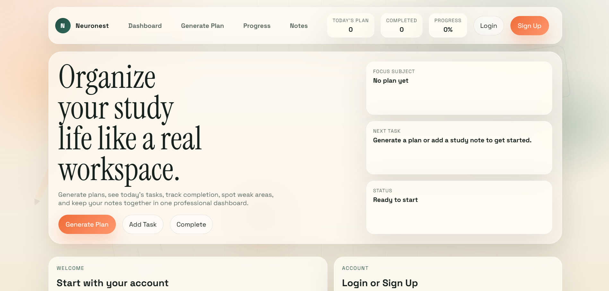
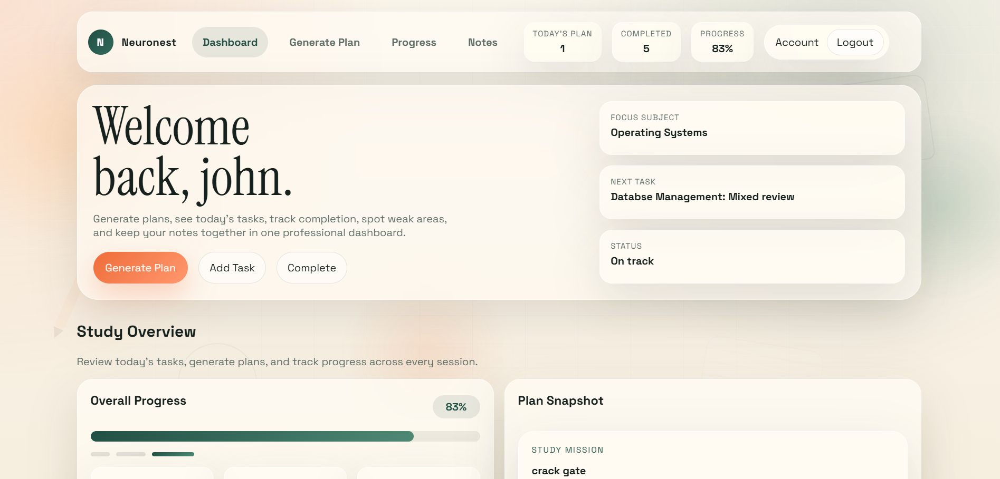
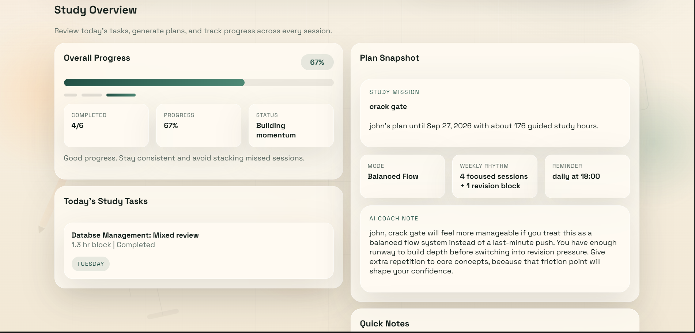
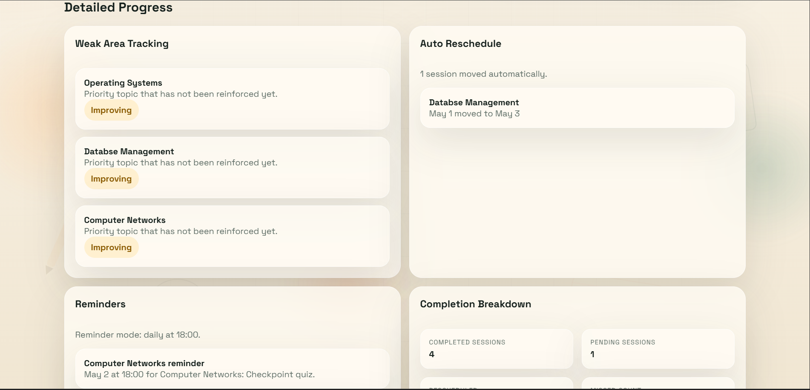

# 📚 AI Study Planner (DTI Project)

AI Study Planner is a simple web-based application designed to help students organize their study schedule, manage tasks, track progress, and improve productivity using a structured planning system.
🌐 Live Demo: https://naga-lakshmi10.github.io/ai-study-planner-DTI/ 🔗 Click the link above to explore the live application.

## 🚀 Project Overview
This project is developed as part of the DTI Full Stack Development Lab Project. It helps users create study plans, add notes, and monitor their daily/weekly progress in an easy and interactive way.

## ✨ Features
- Home Dashboard
- Create Study Plans
- Add and Manage Notes
- Track Study Progress
- Study Overview Section
- Responsive User Interface

## 🛠️ Technologies Used
- HTML
- CSS
- JavaScript

## 📁 Project Structure
ai-study-planner-DTI/
├── index.html
├── style.css
├── script.js
├── screenshots/
├── AI_Powered_Study_Planner.pptx
├── AI_Study_planner_Documentation.pdf
└── DOCUMENTATION.md

## 📸 Screenshots
Screenshots of the project are available in the `screenshots` folder showing:
## 📸 Screenshots

### Home Page

### Dashboard

### Studyoveriew Page

### Progress Tracking

## ▶️ How to Run
1. Download or clone the repository  
2. Open `index.html` in any web browser  
3. Start using the application

## 🎯 Objective
To design and develop a simple AI-based study planner that helps students manage time effectively, stay organized, and track academic progress.

## 👩‍💻 Author
Naga Lakshmi  
DTI Full Stack Development Project

## 📌 Note
This project is created for academic purposes only.
